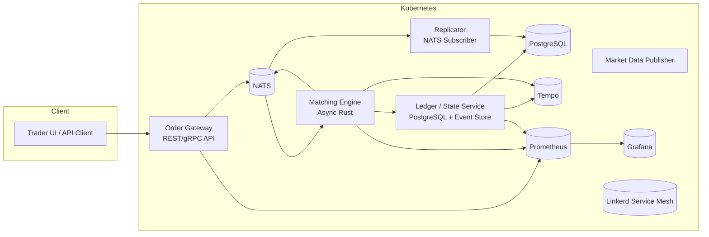

# Distributed Exchange (DEX) Infrastructure

## Rust + Kubernetes Bare Metal Implementation

---

## Overview

This project implements a **fully observable, distributed exchange (DEX) backend** on a **bare-metal K3s cluster**, using **Rust microservices**, **GitOps deployment**, and **modern observability tooling**.
The goal is to reproduce a **production-grade architecture** that mirrors real DEX infrastructure:
fast, reliable, fault-tolerant, and fully monitored.

---

## Objectives

- Build and operate a complete microservice-based exchange backend.
- Use **Rust** for all core logic and **Kubernetes** for orchestration.
- Manage infrastructure declaratively via **ArgoCD (GitOps)**.
- Achieve **full observability** with metrics, tracing, and logs.
- Design for **durability, high availability, and event-driven architecture**.

---

## System Architecture



## Core Services (Rust)

### 1. Order Gateway

- Entry point for all client requests.
- Exposes REST + gRPC endpoints.
- Validates, authenticates, rate-limits, and forwards orders to NATS.

### 2. Matching Engine

- Maintains in-memory order books.
- Matches orders, generates trade events, updates balances.
- Communicates asynchronously via Tokio and tonic.
- Publishes all trades and updates to NATS.

### 3. Ledger / State Service

- Authoritative persistence layer.
- Stores accounts, balances, and trades in PostgreSQL.
- Event-sourced design (append-only event log).
- Provides replay mechanism for state recovery.

### 4. Replicator

- Subscribes to all NATS event topics.
- Streams to audit logs, analytics, or monitoring systems.
- Enables horizontal scalability.

### 5. Market Data Publisher (Optional)

- Aggregates trades and order-book updates.
- Serves WebSocket or gRPC streaming endpoints for public data.

## Infrastructure Components

| Component | Tool | Purpose |
|-----------|------|---------|
| Cluster | K3s | Lightweight Kubernetes for bare metal |
| GitOps | ArgoCD | Declarative infra and app deployment |
| CI/CD | Drone | Build + deploy Rust microservices |
| Metrics | Prometheus | Collect service and system metrics |
| Dashboards | Grafana | Visualize metrics and traces |
| Tracing | Tempo | Distributed tracing backend |
| Message Bus | NATS | Pub/Sub and streaming for inter-service comms |
| Database | PostgreSQL | Canonical data store |
| Service Mesh | Linkerd | Secure service-to-service traffic |
| Coordination | etcd (optional) | Leader election and configuration consistency |

## Deployment Topology

### Bare Metal Cluster

- 1 Control Plane Node
- 2+ Worker Nodes
- Networking: Flannel or Cilium
- Storage: Longhorn or Local PV
- Ingress: Traefik or NGINX

## Deployment Model

- Each service packaged as Docker image.
- Managed via Helm + ArgoCD.
- Versioned configuration in Git (infra/ directory).
- CI (Drone) builds and pushes images, triggers Argo sync.

## Database Schema (Simplified)

```sql
CREATE TABLE accounts (
  user_id UUID PRIMARY KEY,
  balance NUMERIC NOT NULL,
  currency TEXT NOT NULL
);

CREATE TABLE orders (
  id UUID PRIMARY KEY,
  user_id UUID,
  symbol TEXT,
  side TEXT,
  price NUMERIC,
  quantity NUMERIC,
  status TEXT,
  created_at TIMESTAMP DEFAULT NOW()
);

CREATE TABLE trades (
  id UUID PRIMARY KEY,
  buy_order UUID,
  sell_order UUID,
  price NUMERIC,
  quantity NUMERIC,
  timestamp TIMESTAMP DEFAULT NOW()
);

CREATE TABLE events (
  seq BIGSERIAL PRIMARY KEY,
  event_type TEXT,
  payload JSONB,
  created_at TIMESTAMP DEFAULT NOW()
);
```

## Observability

### Metrics

Prometheus scrapes metrics from all Rust services.

Grafana dashboards:

- p95/p99 latency
- Orders processed/sec
- Matching throughput
- DB query time

### Tracing

Tempo collects distributed traces from services via OpenTelemetry.

Visualize full order lifecycle from gateway → matching → ledger.

### Logging

Optionally use Loki for centralized logs.

## Security and Reliability

- Linkerd mTLS for all internal communication.
- PostgreSQL backups via CronJob (daily).
- Sealed Secrets for credential management.
- Crash recovery: replay event log to restore state.
- Prometheus alerting: DB down, latency spikes, node failure.

## Implementation Phases

| Phase | Description | Deliverables |
|-------|-------------|-------------|
| 1. Cluster Setup | K3s deployment, ArgoCD, Prometheus, Grafana | Operational cluster + dashboards |
| 2. Rust Services MVP | Implement Order Gateway, Matching Engine, Ledger | Functional trade flow |
| 3. Persistence | Integrate PostgreSQL and event sourcing | Durable ledger + replay |
| 4. Observability | Add Tempo, metrics, and dashboards | Full visibility |
| 5. CI/CD | Add Drone + GitOps integration | Automated deploys |
| 6. Service Mesh | Deploy Linkerd for mTLS + metrics | Secure communication |
| 7. Scaling/Resilience | Add NATS replication, simulate node failures | Verified HA |
| 8. Advanced | Optional Raft, market data streaming, audits | Complete production mirror |

## Stretch Goals

- Raft-based ledger replication.
- WebSocket market data service.
- Order replay and recovery automation.
- Merkle proof generation for trade integrity.
- Benchmark suite with Vegeta or k6.

## Example Repository Structure

```
dex/
├── services/
│   ├── order-gateway/
│   ├── matching-engine/
│   ├── ledger-service/
│   ├── replicator/
│   └── market-data/
├── infra/
│   ├── helm/
│   ├── argocd/
│   ├── drone/
│   └── k8s/
├── dashboards/
│   ├── grafana/
│   └── prometheus/
└── docs/
    ├── architecture.md
    └── setup.md
```

## Tools and Versions

| Tool | Version |
|------|---------|
| Rust | 1.82+ |
| PostgreSQL | 16.x |
| NATS | latest |
| Prometheus | 2.54+ |
| Grafana | 11+ |
| Tempo | 2.5+ |
| ArgoCD | 2.12+ |
| Drone | 2.20+ |
| Linkerd | 2.15+ |
| K3s | latest stable |

## Benchmarks and Validation

Generate synthetic orders with wrk or Vegeta.

Measure latency and throughput (orders/sec).

### Target

- 5k+ orders/sec sustained on local cluster.
- <10ms matching latency under load.
